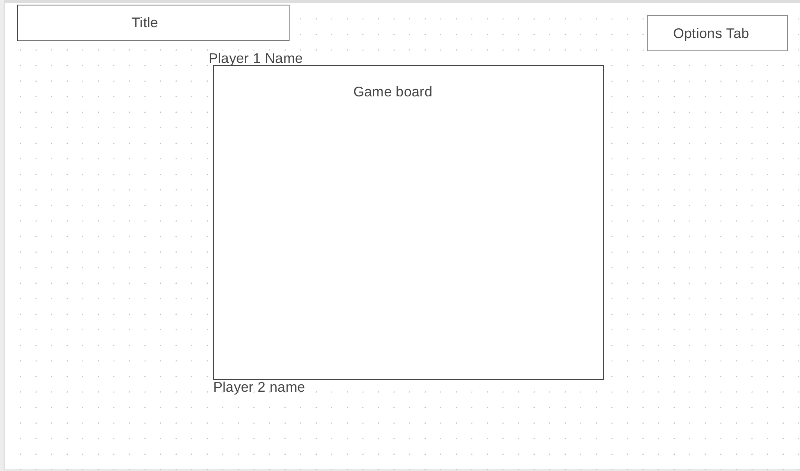

# Othello Reloaded

## Background
This project is going to focus on creating a working version of Othello. Once completed,
different computer players will be implemented using some of the popular
algorithms in Artificial Intelligence.

## Functionality and MVPs
Users in this game will be able to: 
* Start and reset the game board
* Select squares that are live and be able to make their move on that square
* Choose from a list of computer players, each of which would rely on a different algorithm

This project will also include:
* A production README
* A tutorial for how to play the game and how different algorithms work

## Wireframes

## Technologies, Libraries, APIs
* Webpack and Babel to bundle and transpile the source JavaScript code
* npm to manage tproject dependencies

## Implementation Timeline
* __Friday:__ 
Start with the project. Finish with the implementation for the
game logic of othello
* __Weekend:__ 
Look into minimmax algorithm, alpha beta pruning and monnte carlo
* __Monday:__  
Finish off with the implementation of computer players with research on
different heuristics.
* __Tuesday:__ 
Implement the front end. Have the board and controls be displayed nicely to the user.
Also, add animation to the flipping of board pieces
* __Wednesday:__ 
Look into the visualization for tree structure for different computer players
* __Thursday:__ 
Deploy the website online, possibly on heroku

## Bonus Features
* Visualization of the tree data structure for each algorithm
* Pit the computer players against each other and visualize that data to better judge
different AI algorithms. 
* Give the human player the option of possibly defeating the show off computer player 
by throwing a fireball at the computer player and distracting it!